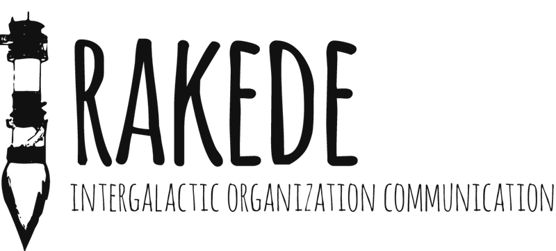

## Getting Started

``` bash
# install dependencies
$ npm install # Or yarn install

# serve with hot reload at localhost:3000
$ npm run dev

# build for production and launch server
$ npm start
```

For detailed explanation on how things work, checkout the [Nuxt.js docs](https://github.com/nuxt/nuxt.js).

## Changelog

__0.0.0__

- Nothing to release yet

## License

Licensed under the [MIT license](LICENSE).

## Backpack

We use [backpack](https://github.com/palmerhq/backpack) to watch and build the application, so you can use the latest ES6 features (module syntax, async/await, etc.).
